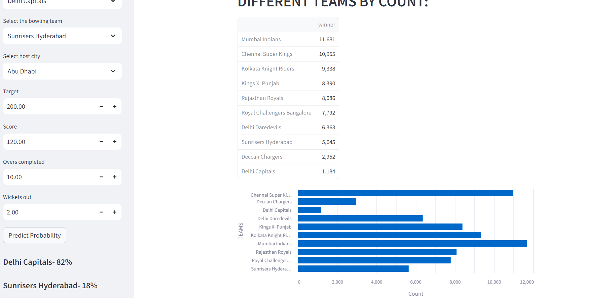

Developed a machine learning model using Logistic Regression to predict the probability of the batting team winning based on the target score. Achieved 86% accuracy and utilized various visualization techniques to analyze and present the data effectively.

